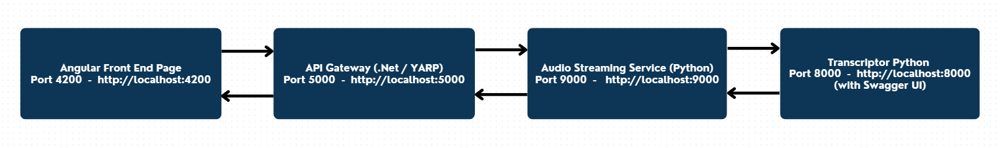
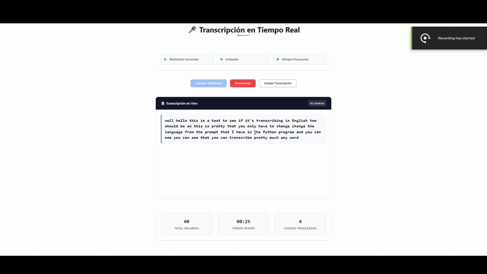
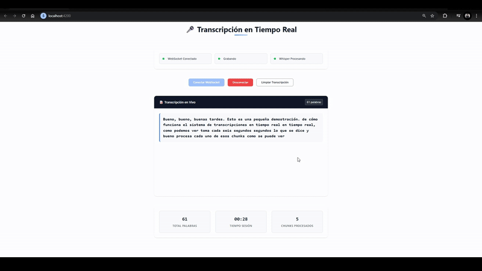
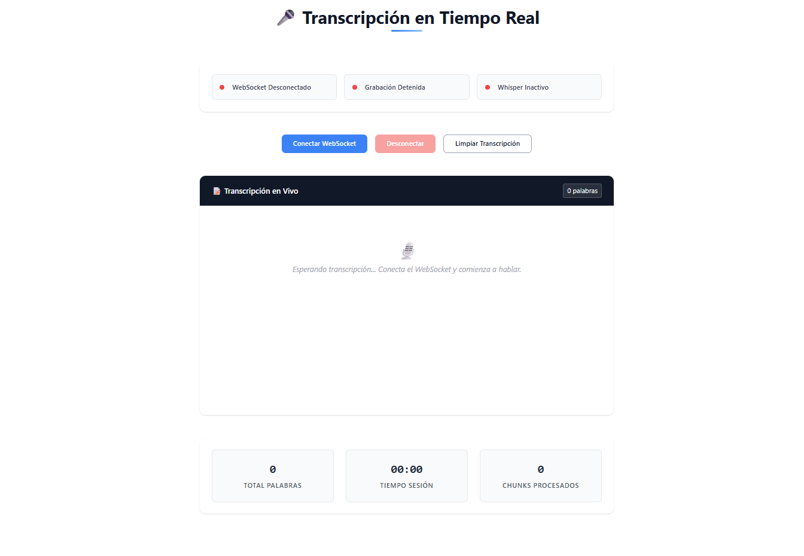
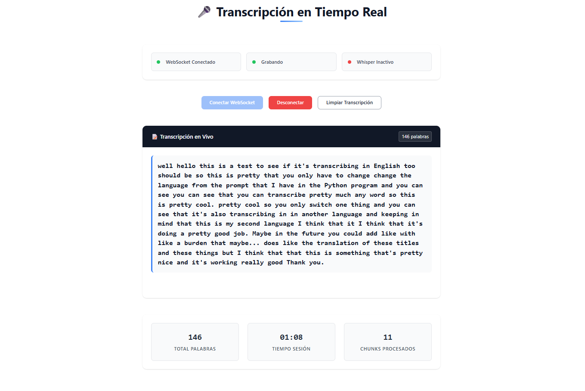
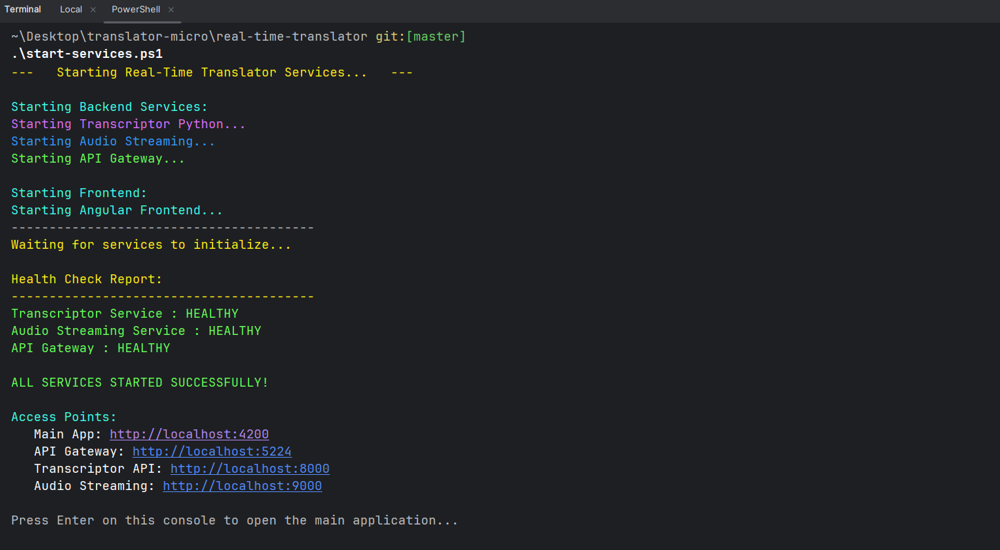
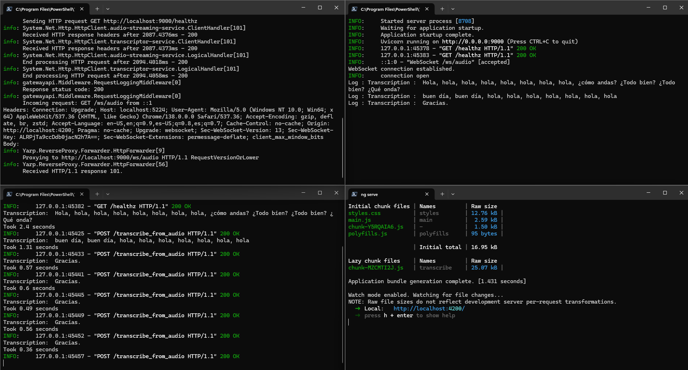
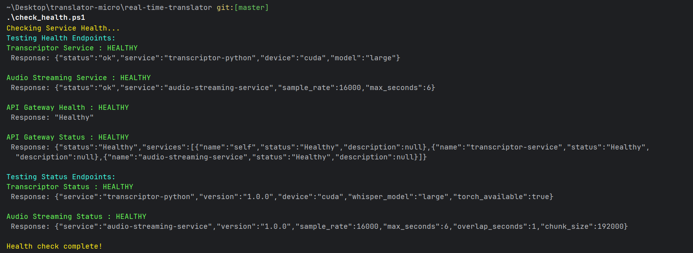

# Real-Time Audio Transcription System

## TLDR
A microservices-based real-time audio transcription system built with Angular frontend, .NET API Gateway, and Python services. Users can record audio through their browser, which gets processed in real-time by OpenAI's Whisper model to provide live transcriptions with overlap handling and word counting features.

---

## Architecture Overview

This project implements a **microservices architecture** for real-time audio transcription :

---

#### End-to-End Communication Flow Between Services



---

### Components

1. **Angular Frontend**: Modern web interface for audio recording and transcription display
2. **API Gateway (.NET)**: YARP-based reverse proxy routing requests to backend services
3. **Audio Streaming Service**: FastAPI service handling WebSocket audio streams
4. **Transcriptor Python**: Whisper-powered transcription service with GPU acceleration

---

##  Application Preview

### Live Transcription Demos

#### English Transcription Demo


- English Live Transcription

#### Spanish Transcription Demo


- Spanish Live Transcription

### Default Interface


- Default Page

### Transcription Results



---

## Features

- **Real-time audio recording** through browser microphone
- **Live transcription** with Whisper AI model
- **Session analytics** (word count, processing time, chunks processed)
- **Overlap handling** to prevent repeated words in transcription
- **WebSocket-based** low-latency audio streaming
- **GPU acceleration** support for faster transcription
- **Docker containerization** for easy deployment
- **Database logging** with automatic transcription storage and data retention

---

## Database Integration

Automatic transcription logging with configurable data retention:

### Features
- **Non-blocking logging**: Database failures don't affect transcription performance
- **PII-safe**: IP addresses are hashed, minimal metadata stored
- **Data retention**: Configurable cleanup (default: 90 days)
- **Dual database support**: SQLite (dev) / PostgreSQL (prod)

### API Endpoints
- `GET /api/transcriptions` - Query transcription logs
- `GET /api/transcriptions/{id}` - Get specific transcription
- `GET /health/status` - Health checks including database connectivity

### Configuration
```json
{
  "Database": {
    "Provider": "Sqlite|PostgreSQL",
    "RetentionDays": 90,
    "CleanupIntervalHours": 24
  }
}
```

---

## Prerequisites

### Required Software

- **Node.js** (v18 or higher) and **npm**
- **.NET 8 SDK**
- **Python 3.10+**
- **Docker** (optional, for containerized deployment)
- **CUDA-compatible GPU** (optional, for faster transcription)

### Python Dependencies
The following packages will be installed automatically:
- FastAPI & Uvicorn
- OpenAI Whisper
- PyTorch (with CUDA support if available)
- Audio processing libraries (pydub, sounddevice)

---

## Installation & Setup

### 1. Clone the Repository
```bash
git clone <repository-url>
cd real-time-translator
```

### 2. Setup Python Services

#### Transcriptor Python Service
```bash
cd transcriptor-python
```

**Install Python dependencies:**
```bash
pip install torch torchvision torchaudio --index-url https://download.pytorch.org/whl/cu118  # For CUDA
# OR for CPU only:
pip install torch torchvision torchaudio

pip install fastapi uvicorn openai-whisper httpx tempfile-utils
```

#### Audio Streaming Service
```bash
cd audio-streaming-service
pip install -r requirements.txt
```

### 3. Setup .NET API Gateway
```bash
cd api-gateway/gatewayapi
dotnet restore
dotnet build
```

### 4. Setup Angular Frontend
```bash
cd angular-front
npm install
```

---

## Running the Application

### Option 1: Manual Service Startup (Recommended for Development)

**Start services in this order:**

1. **Transcriptor Python Service:**
   ```bash
   cd transcriptor-python
   uvicorn main:app --host 0.0.0.0 --port 8000
   ```

2. **Audio Streaming Service:**
   ```bash
   cd audio-streaming-service
   uvicorn main:app --host 0.0.0.0 --port 9000
   ```

3. **API Gateway (.NET):**
   - Open `api-gateway/gatewayapi` folder in your IDE
   - Run the project (it will start on port 5000)

4. **Angular Frontend:**
   - Open `angular-front` folder in your IDE
   - Run `ng serve` or use IDE's built-in Angular support (starts on port 4200)

### Option 2: PowerShell Scripts (Windows - Automated Startup)

For Windows users, you can use the provided PowerShell scripts that automate the entire startup process with health monitoring :

#### **`start-services.ps1` - Complete Application Startup**
This script automatically starts all services and performs health checks:



```powershell
.\start-services.ps1
```

**What it does:**
- Starts all 4 services in separate PowerShell windows (you'll see 4 new terminal windows open)
- Each service runs in its own dedicated terminal for easy monitoring and log viewing
- Waits for services to initialize (10 seconds)
- Automatically runs health checks on all endpoints
- Opens the main application in your browser if all services are healthy
- Shows real-time status and service URLs

This is what you will see when the 4 terminals, are correctly executed.



**Terminal Windows Opened:**
1. **Transcriptor Python Service** - Port 8000 (Magenta window)
2. **Audio Streaming Service** - Port 9000 (Blue window) 
3. **API Gateway (.NET)** - Port 5224 (Green window)
4. **Angular Frontend** - Port 4200 (Cyan window)

#### **`check_health.ps1` - Standalone Health Monitoring**
Quick health check script for when services are already running:



```powershell
.\check_health.ps1
```

**What it does:**
- Tests all service health endpoints (`/healthz`)
- Tests detailed status endpoints (`/status`)
- Shows service responses and configuration details
- Identifies which services are unreachable
- Perfect for troubleshooting and monitoring


### Option 3: Docker Compose (Production)
```bash
docker-compose up --build
```

---

## Access Points

Once all services are running, you can access them at the following URLs:

- **Main Application**: http://localhost:4200
- **API Gateway**: http://localhost:5224 (YARP reverse proxy)
- **Transcriptor API**: http://localhost:8000 (with Swagger UI)
- **Audio Streaming**: http://localhost:9000
- **Transcription Logs**: http://localhost:5224/api/transcriptions

### Health Check Endpoints

- **API Gateway Health**: http://localhost:5224/health
- **API Gateway Status**: http://localhost:5224/health/status (includes database connectivity)
- **Transcriptor Health**: http://localhost:8000/healthz
- **Audio Streaming Health**: http://localhost:9000/healthz

### Manual Testing

Use the included `.http` file for API testing:
```
api-gateway/gatewayapi/test-api.http
```

---

## How It Works

1. **User Interface**: Angular app provides a clean interface for recording control
2. **Audio Capture**: Browser captures microphone audio and streams via WebSocket
3. **Audio Processing**: Audio streaming service buffers audio chunks with overlap
4. **Transcription**: Whisper model processes audio chunks and returns text
5. **Database Logging**: API Gateway automatically logs completed transcriptions
6. **Real-time Display**: Transcribed text appears live with duplicate word filtering
7. **Data Retention**: Background service cleans up old logs based on retention policy

---

## Health Monitoring System

The application includes a comprehensive health monitoring system to ensure all microservices are running correctly:

### **Built-in Health Checks**
- **API Gateway**: Monitors itself and all downstream services
- **Python Services**: Enhanced `/healthz` and `/status` endpoints with service details
- **YARP Integration**: Health check routes for centralized monitoring
- **Real-time Status**: PowerShell scripts provide live service status updates

### **Monitoring Features**
- **Service Discovery**: Automatic detection of unhealthy services
- **Detailed Reporting**: JSON responses with service configuration details
- **Retry Logic**: Health checks with configurable retry attempts
- **Visual Feedback**: Color-coded status indicators (Healthy - Green, Unhealthy - Red, Waiting - Gray)

### **Usage Examples**
```powershell
# Start everything with automatic health checks
.\start-services.ps1

# Quick health check of running services
.\check_health.ps1

# Python-based health testing
python test_health.py
```

---

## Configuration

### Whisper Model Configuration
The transcriptor service uses the **large** Whisper model by default. You can modify this in `transcriptor-python/main.py`:

```python
model = whisper.load_model("large", device=device)  # Options: tiny, base, small, medium, large , you can also set language
```

### Audio Processing Settings
Audio chunk settings can be adjusted in `audio-streaming-service/main.py`:

```python
SAMPLE_RATE = 16000      # Audio sample rate
MAX_SECONDS = 6          # Chunk duration
OVERLAP_SECONDS = 1      # Overlap for continuity
```

---

## Docker Deployment

The project includes Docker configuration for containerized deployment:

- Each service has its own `Dockerfile`
- `docker-compose.yml` orchestrates all services
- Production-ready configuration with proper networking

---

## Troubleshooting

### Common Issues

**CUDA/GPU Issues:**
- Ensure CUDA drivers are properly installed (keep in mind where is installed if you run the docker compose or locally)
- The service will automatically fall back to CPU if GPU is unavailable

**WebSocket Connection Issues:**
- Check that all services are running on their designated ports
- Verify firewall settings allow connections on ports 5000, 8000, 9000

**Audio Recording Issues:**
- Ensure browser permissions for microphone access
- Use HTTPS in production for microphone access

**Installation Issues:**
- Make sure all prerequisites are installed
- Check Python version compatibility (3.10+)
- Verify .NET 8 SDK installation

---

*Isaac Jordan - 2025 - C# .Net - Java Springboot Back-End Developer!*
