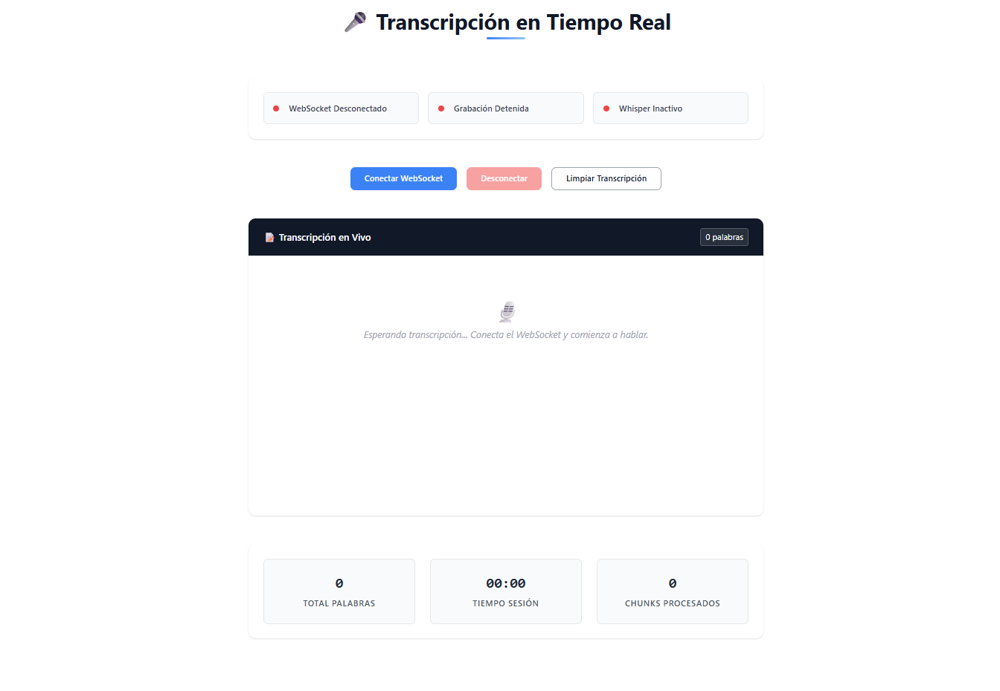
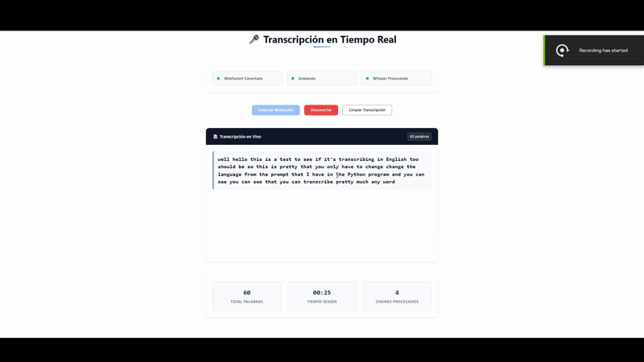
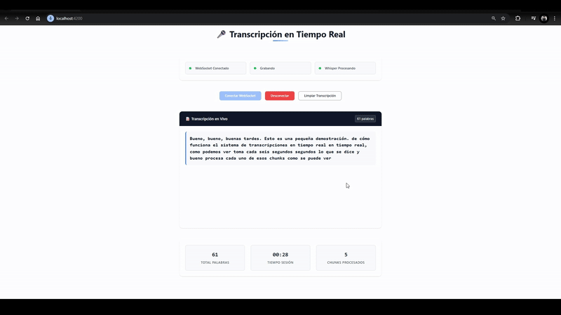
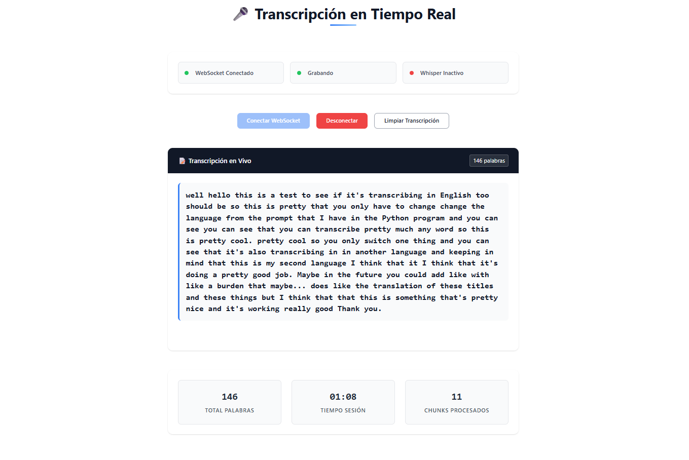

# 🎤 Real-Time Audio Transcription System

## 📋 TLDR
A microservices-based real-time audio transcription system built with Angular frontend, .NET API Gateway, and Python services. Users can record audio through their browser, which gets processed in real-time by OpenAI's Whisper model to provide live transcriptions with overlap handling and word counting features.

---

## 🏗️ Architecture Overview

This project implements a **microservices architecture** for real-time audio transcription:

```
┌─────────────────┐    ┌─────────────────┐    ┌─────────────────┐    ┌─────────────────┐
│  Angular Front  │ -> │  API Gateway    │ -> │ Audio Streaming │ -> │ Transcriptor    │
│     (Port 4200) │    │   (.NET/YARP)   │    │   Service       │    │    Python       │
│                 │    │   (Port 5000)   │    │  (Port 9000)    │    │  (Port 8000)    │
└─────────────────┘    └─────────────────┘    └─────────────────┘    └─────────────────┘
```

### 🔧 Components

1. **Angular Frontend**: Modern web interface for audio recording and transcription display
2. **API Gateway (.NET)**: YARP-based reverse proxy routing requests to backend services
3. **Audio Streaming Service**: FastAPI service handling WebSocket audio streams
4. **Transcriptor Python**: Whisper-powered transcription service with GPU acceleration

---

## 🖼️ Application Preview

### Default Interface

*Clean, modern interface ready for real-time audio transcription*

### Live Transcription Demos

#### English Transcription Demo

*Real-time English speech-to-text transcription in action*

#### Spanish Transcription Demo

*Demonstrating multilingual support with Spanish audio transcription*

### Transcription Results

*Example of completed English transcription with session analytics*

---

## ✨ Features

- 🎙️ **Real-time audio recording** through browser microphone
- 🔄 **Live transcription** with Whisper AI model
- 📊 **Session analytics** (word count, processing time, chunks processed)
- 🔄 **Overlap handling** to prevent repeated words in transcription
- 🎯 **WebSocket-based** low-latency audio streaming
- 🚀 **GPU acceleration** support for faster transcription
- 🐳 **Docker containerization** for easy deployment

---

## 🛠️ Prerequisites

### Required Software

- **Node.js** (v18 or higher) and **npm**
- **.NET 8 SDK**
- **Python 3.10+**
- **Docker** (optional, for containerized deployment)
- **CUDA-compatible GPU** (optional, for faster transcription)

### Python Dependencies
The following packages will be installed automatically:
- FastAPI & Uvicorn
- OpenAI Whisper
- PyTorch (with CUDA support if available)
- Audio processing libraries (pydub, sounddevice)

---

## 🚀 Installation & Setup

### 1. Clone the Repository
```bash
git clone <repository-url>
cd real-time-translator
```

### 2. Setup Python Services

#### Transcriptor Python Service
```bash
cd transcriptor-python
```

**Install Python dependencies:**
```bash
pip install torch torchvision torchaudio --index-url https://download.pytorch.org/whl/cu118  # For CUDA
# OR for CPU only:
pip install torch torchvision torchaudio

pip install fastapi uvicorn openai-whisper httpx tempfile-utils
```

#### Audio Streaming Service
```bash
cd audio-streaming-service
pip install -r requirements.txt
```

### 3. Setup .NET API Gateway
```bash
cd api-gateway/gatewayapi
dotnet restore
dotnet build
```

### 4. Setup Angular Frontend
```bash
cd angular-front
npm install
```

---

## 🏃‍♂️ Running the Application

### Option 1: Manual Service Startup (Recommended for Development)

**Start services in this order:**

1. **Transcriptor Python Service:**
   ```bash
   cd transcriptor-python
   uvicorn main:app --host 0.0.0.0 --port 8000
   ```

2. **Audio Streaming Service:**
   ```bash
   cd audio-streaming-service
   uvicorn main:app --host 0.0.0.0 --port 9000
   ```

3. **API Gateway (.NET):**
   - Open `api-gateway/gatewayapi` folder in your IDE
   - Run the project (it will start on port 5000)

4. **Angular Frontend:**
   - Open `angular-front` folder in your IDE
   - Run `ng serve` or use IDE's built-in Angular support (starts on port 4200)

### Option 2: Docker Compose (Production)
```bash
docker-compose up --build
```

---

## 🌐 Access Points

Once all services are running:

- **Main Application**: http://localhost:4200
- **API Gateway**: http://localhost:5000
- **Transcriptor API**: http://localhost:8000 (with Swagger UI)
- **Audio Streaming**: http://localhost:9000

---

## 🎯 How It Works

1. **User Interface**: Angular app provides a clean interface for recording control
2. **Audio Capture**: Browser captures microphone audio and streams via WebSocket
3. **Audio Processing**: Audio streaming service buffers audio chunks with overlap
4. **Transcription**: Whisper model processes audio chunks and returns text
5. **Real-time Display**: Transcribed text appears live with duplicate word filtering
6. **Analytics**: Session metrics are tracked and displayed in real-time

---

## 🔧 Configuration

### Whisper Model Configuration
The transcriptor service uses the **large** Whisper model by default. You can modify this in `transcriptor-python/main.py`:

```python
model = whisper.load_model("large", device=device)  # Options: tiny, base, small, medium, large
```

### Audio Processing Settings
Audio chunk settings can be adjusted in `audio-streaming-service/main.py`:

```python
SAMPLE_RATE = 16000      # Audio sample rate
MAX_SECONDS = 6          # Chunk duration
OVERLAP_SECONDS = 1      # Overlap for continuity
```

---

## 🐳 Docker Deployment

The project includes Docker configuration for containerized deployment:

- Each service has its own `Dockerfile`
- `docker-compose.yml` orchestrates all services
- Production-ready configuration with proper networking

---

## 🔍 Troubleshooting

### Common Issues

**CUDA/GPU Issues:**
- Ensure CUDA drivers are properly installed (keep in mind where is installed if you run the docker compose or locally)
- The service will automatically fall back to CPU if GPU is unavailable

**WebSocket Connection Issues:**
- Check that all services are running on their designated ports
- Verify firewall settings allow connections on ports 5000, 8000, 9000

**Audio Recording Issues:**
- Ensure browser permissions for microphone access
- Use HTTPS in production for microphone access

**Installation Issues:**
- Make sure all prerequisites are installed
- Check Python version compatibility (3.10+)
- Verify .NET 8 SDK installation

---

*Isaac Jordan - 2025 - C# .Net - Java Springboot Back-End Developer!*
